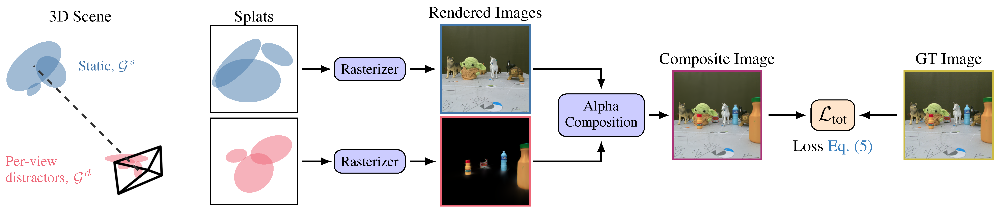

<div align="center">

  # <strong>DeSplat</strong>: Decomposed Gaussian Splatting for Distractor-Free Rendering

  <p align="center">
    <a href="https://johanna0626.github.io/">Yihao Wang</a> ·
    <a href="https://marcusklasson.github.io/">Marcus Klasson</a> ·
    <a href="https://maturk.github.io/">Matias Turkulainen</a> ·
    <a href="https://ffrivera0.github.io/">Shuzhe Wang</a> ·
    <a href="https://users.aalto.fi/~kannalj1/">Juho Kannala</a> ·
    <a href="https://users.aalto.fi/~asolin/">Arno Solin</a>
  </p>

  <h2 align="center">CVPR 2025</h2>

  <h3>
    <a href="https://arxiv.org/abs/2411.19756">Paper</a> |
    <a href="https://aaltoml.github.io/desplat/">Project Page</a>
  </h3>

</div>

---

This is the original code of DeSplat on [NerfStudio](http://www.nerf.studio/) codebase.

<div align="center">
  
  <p>Overall pipeline of our method.</p>
</div>

## Installation
Setup conda environment:
```
conda create --name desplat -y python=3.8
conda activate desplat
pip install torch==2.1.2+cu118 torchvision==0.16.2+cu118 --extra-index-url https://download.pytorch.org/whl/cu118
conda install -c "nvidia/label/cuda-11.8.0" cuda-toolkit
```

Install DeSplat:
```
git clone https://github.com/AaltoML/desplat.git
cd desplat
pip install -e .
ns-install-cli
```

## Download datasets

We provide a convenient script to downloading compatible datasets. 

To download the datasets, run the `download_dataset.py` script:
```
python scripts/download_dataset.py --dataset ["robustnerf" or "on-the-go"]
```

Alternatively you can also run the following commands:
- **RobustNeRF Dataset:**
```
wget https://storage.googleapis.com/jax3d-public/projects/robustnerf/robustnerf.tar.gz
tar -xvf robustnerf.tar.gz
```
RobustNeRF Dataset includes pre-generated COLMAP points, we do not need to convert the data.

- **On-the-go Dataset:**
To download the undistorted and down-sampled on-the-go dataset, you can either access it on Hugging Face: [link](https://huggingface.co/datasets/jkulhanek/nerfonthego-undistorted/tree/main) or download and preprocess it using the following bash script.

```
bash scripts/download_on-the-go_processing.sh
```
This Bash script automatically downloads the data, processes it using COLMAP, and downsamples the images. For downsampling, you may need to install ImageMagick.
```
# install ImageMagick if there is not on your computer:
conda install -c conda-forge imagemagick
# install COLMAP if there is not on your computer:
conda install conda-forge::colmap
```
> **Note**: The initial On-the-go dataset does not include COLMAP points, so preprocessing is required. For detailed preprocessing steps, please refer to the instructions below.

<details close>
<summary>Custom data</summary>
    We support COLMAP based datasets. Ensure your dataset is organized in the following structure:
```
<location>
|---images
|   |---<image 0>
|   |---<image 1>
|   |---...
|---sparse
    |---0
        |---cameras.bin
        |---images.bin
        |---points3D.bin
```
For datasets like the On-the-go Dataset and custom datasets without point cloud information, you need to preprocess them using COLMAP.

To prepare the images for the COLMAP processor, organize your dataset folder as follows:
```
<location>
|---input
    |---<image 0>
    |---<image 1>
    |---...
```
Then, run the following command:
```
# install COLMAP if there is not on your computer:
conda install conda-forge::colmap
python scripts/convert.py -s <location> [--resize] # If not resizing, ImageMagick is not needed

# an example for on-the-go dataset could be:
python scripts/convert.py -s ../data/on-the-go/patio
```

</details>

## Training

For RobustNeRF data, train using:
```
ns-train desplat robustnerf-data --data [path_to_robustnerf_data] 
```

For RobustNeRF data, train using:
```
ns-train desplat onthego-data --data [path_to_onthego_data] 
```

For Photo Tourism data, train using:
```
ns-train desplat --steps_per_save 200000 --max_num_iterations 200000 --pipeline.model.stop_split_at 100000 \
 --pipeline.model.enable_appearance True --pipeline.model.app_per_gauss True phototourism-data --data [path_to_onthego_data]
```

You can adjust the configuration by switching options such as `--pipeline.model.use_adc`. For more details, please refer to `desplat_model.py` for a closer look.


## Known Issues

Due to differences in the optimization method, running the code directly within the Nerfstudio framework may result in the following issue:
<details close>
<summary>Traceback error</summary>

```
Traceback (most recent call last):
  File "/******/ns-train", line 8, in <module>
    sys.exit(entrypoint())
  File "/******/site-packages/nerfstudio/scripts/train.py", line 262, in entrypoint
    main(
  File "/******/site-packages/nerfstudio/scripts/train.py", line 247, in main
    launch(
  File "/******/site-packages/nerfstudio/scripts/train.py", line 189, in launch
    main_func(local_rank=0, world_size=world_size, config=config)
  File "/******/site-packages/nerfstudio/scripts/train.py", line 100, in train_loop
    trainer.train()
  File "/******/site-packages/nerfstudio/engine/trainer.py", line 301, in train
    self.save_checkpoint(step)
  File "/******/site-packages/nerfstudio/utils/decorators.py", line 82, in wrapper
    ret = func(*args, **kwargs)
  File "/******/site-packages/nerfstudio/engine/trainer.py", line 467, in save_checkpoint
    "optimizers": {k: v.state_dict() for (k, v) in self.optimizers.optimizers.items()},
  File "/******/site-packages/nerfstudio/engine/trainer.py", line 467, in <dictcomp>
    "optimizers": {k: v.state_dict() for (k, v) in self.optimizers.optimizers.items()},
  File "/******/site-packages/torch/_compile.py", line 31, in inner
    return disable_fn(*args, **kwargs)
  File "/******/site-packages/torch/_dynamo/eval_frame.py", line 600, in _fn
    return fn(*args, **kwargs)
  File "/******/site-packages/torch/optim/optimizer.py", line 705, in state_dict
    packed_state = {
  File "/******/site-packages/torch/optim/optimizer.py", line 706, in <dictcomp>
    (param_mappings[id(k)] if isinstance(k, torch.Tensor) else k): v
KeyError: ******
```
</details>

To temporarily resolve this issue, my solution is to comment out the following two lines in the Nerfstudio library file `/nerfstudio/engine/trainer.py` (in Nerfstudio version 1.1.3, these are lines 467 and 468):

```
"optimizers": {k: v.state_dict() for (k, v) in self.optimizers.optimizers.items()},
"schedulers": {k: v.state_dict() for (k, v) in self.optimizers.schedulers.items()},
```          


## Rendering

To render a video, we need to use `ns-render`. The simple command is:
```
ns-render camera-path/interpolate/spiral/dataset --load-config .../config.yml
```
To render the images of the whole dataset for visualization, use the following command:
```
ns-render dataset --split train+test --load-config <PATH TO CONFIG>  --output-path <PATH TO SAVE IMGS>
```

## Test-Time Optimization (TTO)

For datasets with complex weather and lighting variations, using per-image embeddings and test-time optimization is essential. During training, you can run the following command:
```
ns-train desplat --pipeline.model.enable_appearance True phototourism-data --data [data-path]
```
After completing the training, you will get a `.ckpt` file and a configuration path. To perform test-time optimization, run:
```
python scripts/test_time_optimize.py --load-config [config-path]
```
Adding the `--save_gif` flag saves a `.gif` file for a quick visual review.
Adding the `--save_all_imgs` flag saves all rendered test images.
Adding the `--use_saved_embedding` flag loads the saved appearance embeddings.

## Citation

```
@InProceedings{wang2024desplat,
    title={{DeSplat}: Decomposed {G}aussian Splatting for Distractor-Free Rendering},
    author={Wang, Yihao and Klasson, Marcus and Turkulainen, Matias and Wang, Shuzhe and Kannala, Juho and Solin, Arno},
    booktitle={IEEE/CVF Conference on Computer Vision and Pattern Recognition (CVPR)},
    year={2025}
}
```

## License
This software is provided under the Apache License 2.0. See the accompanying LICENSE file for details.
